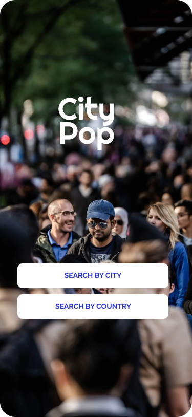
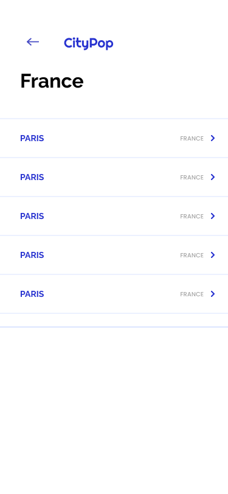
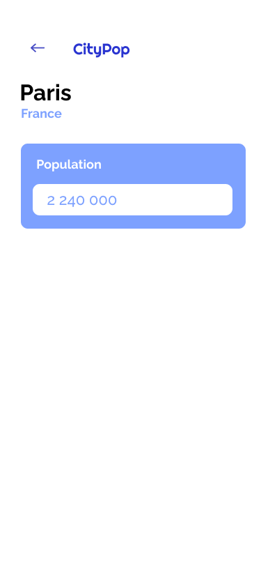

<br />
<p align="center">
    

  <p align="center">
    <a href="https://github.com/OGurso/CityPop/issues">Report Bug</a>
    ·
    <a href="https://github.com/OGurso/CityPop/issues">Request Feature</a>
  </p>
</p>
<hr />
<p align="center">
  
  
  
</p>
<hr />

### Tech-stack

- TypeScript
- React Native


## Getting Started

To setup this project locally you may follow the installation steps below.

### Installation

1. Update the latest version of your package manager
   ```sh
   npm install expo-cli --global
   ```
2. Clone the repo
   ```sh
   git clone https://github.com/OGurso/CityPop.git
   ```
3. Get into the directory
   ```sh
   cd CityPop
   ```
4. Install NPM packages for the project
   ```sh
   npm install
   ```
5. Start the project
   ```sh
   npm start
   ```

## Usage

  After completing the steps above you need to have a Android device/Emulator or IOS Simulator to use the app.
   - With an android device - Download Expo Go app and scan the QR code from your device after this step.
   - Android Emulator - Make sure you have your emulator up and runing before choose this alternative after this step.
   - On the Web - The easiest alternative to get started with (not recommended - use the above altertives for best experience)

## Contact

- [Onur Gürsoy](https://github.com/OGurso)

